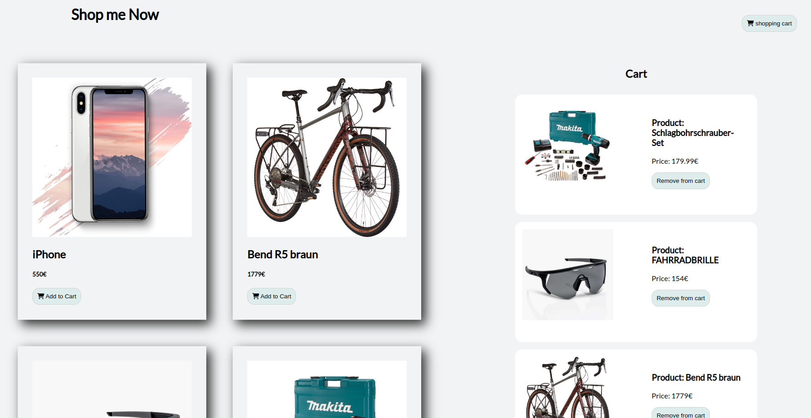
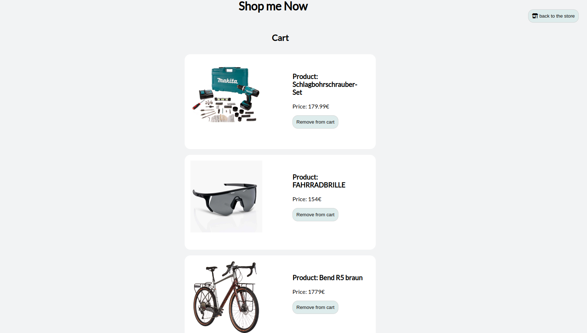

# Shopping

**[Test this app yourself](github.link)**

---

#### Navigation

- About Project
  - _Description_
- How to use this Project
  - _Description_
- Developed With
- Contact
  - _Mail_
  - _GitHub_
  - _LinkedIn_
- Used Tools
  - _Fonts_
  - _Design_
  - _Icons_
  - _Colors_

---

### About Project

Our shop has a List of products.

- Every product got an 'add to cart' button which will add the product to a list that's also stored in localStorage
- The cart is displayed with the same content on the products page and also on the dedicated cart page

### How to use this Project

This is just a simple project that shows you how to create a simple Shopping application.

##### Developed With

- [x] _HTML5_
- [x] _CSS3_
- [ ] _SASS_
- [ ] _SCSS_
- [x] _JavaScript_
- [ ] _React_
- [ ] _Bootstrap_
- [x] _npm_
- [x] _package.json_

---

### Contact

Mail: <oxanadanilova11@gmail.com> 
GitHub: [OxanaDanilova](https://github.com/OxanaDanilova) 
LinkedIn: [Oxana Danilova](https://www.linkedin.com/in/oxana-danilova-b082a0156/)

Mail: <holgeraliusklose@gmail.com> 
GitHub: [Holledrums](https://github.com/holledrums) 
LinkedIn: [Holger Klose](https://www.linkedin.com/in/holger-klose-240831147/)

Mail: <abbasluay1981@gmail.com> 
GitHub: [Luayabbas1981](https://github.com/Luayabbas1981) 

---

### Used Tools

- [icons](https://)
- [Canva](https://www.canva.com/)
- [npm](https://www.npmjs.com/)
- [Google Fonts](https://fonts.google.com/)
- [Visual Studio Code](https://code.visualstudio.com/)
- [ColorZilla](https://www.colorzilla.com/chrome/)

---

Made with ❤️ by us
